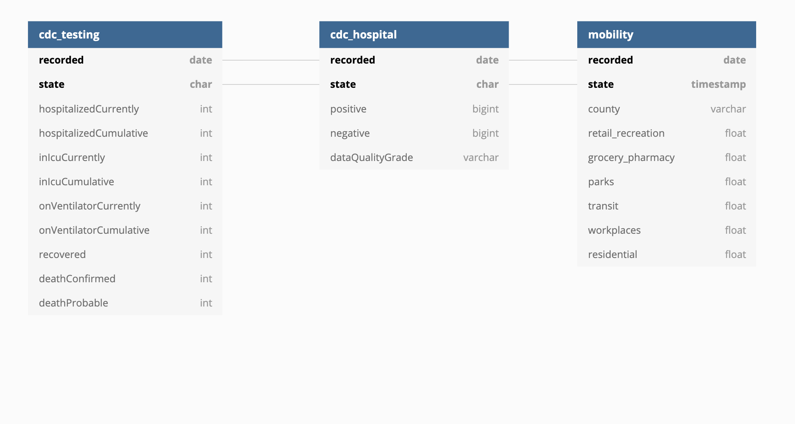

# Data Capstone Project: Corona and mobility data

### Objective
Create ETL database for US Corona data and mobility data for each states.

### Abstract
Covid19 is a current pandemic that threatens lives of many Americans across the state. Using the available free data from online public dataset, this project aims to create a database that can query the incoming corona virus quickly and at scale. In addition, by comparing between two tabulation methods and adding in mobility, we can analyze the process of covid spread across different states.

### Process Steps
- Use `s3_stage.py` to pre-process the data and upload it into the S3 bucket in AWS
- Use `etl.py` to upload the necessary data into our created database

### Datasets and Schema

#### Datasets
CDC Covid19 Data: This dataset includes state-wise occurrence of corona testing, deaths and hospitalization. The data has both cumulative and current measures. Since the dataset is sparse due to missing values, we save both cumulative and current data so that we can verify the accuracy of the report.

NYT Covid19 Data: This dataset is a simpler version of covid occurrences. It records the state-wise incoming occurrences and deaths for each given day.

Mobility: This dataset records state-wise change in mobility in different sectors of society. The sectors include retail_recreation, grocery_pharmacy, parks, transit, workplaces, and residential area.

The data should be updated monthly, since the report might be modified. The data size is not that big, which makes it possible for us to ingest again with new csv file for each dataset.

#### Schema
Since each reporting occurrences does not have specific data that can be partitioned into dimension tables, the design of the schema is concurrent structure of three different tables who are connected by the unique combination of (recorded, state). Each row of data in all tables can be defined by these combination of values, and is the primary key for all three tables. Thus, by joining through these primary key, our queries will be faster and simpler.

### Additional Questions
1. If the data was increased by 100x: If the data is bigger, than it is better to change to airflow where we can ingest data periodically at larger volume.
2. If the pipelines were run on a daily basis by 7am: Airflow again has a suited feature of scheduling data ingestion.
3. If the database needed to be accessed by 100+ people: Redshift can scale vertically, thus we can create multiple copies of the database and give access to each users. Since the data itself is not too big, we can do this at scale quickly.

### Running
Run `s3_stage.py` with appropriate configuration file that stores the AWS constants. Then, run the `etl.py` file to ingest the data.
