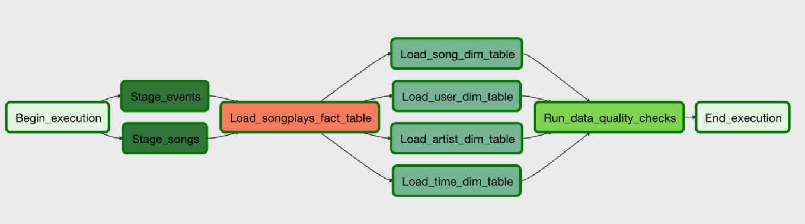

# Data Pipelines with Airflow

## Objective
Using AWS Apache Airflow, design a data pile line that reads in JSON raw data of Sparkify and perform ETL based on our schema.

## Structure

### Default Parameters
- The DAG does not depend on past runs
- The task is retried 3 times with 5 minutes interval on failure
- Catch up and emailing is turned off

### Operators
1. Create Table Operator: Execute all the create table queries
2. Stage to Redshift Operator: Loads any JSON formatted files from S3 to Amazon Redshift. Can distinguish between JSON file or CSV file and allows backfilling based on execution time.
3. Facts and Dimension Operators: Utilize SQL helper class to run appropriate data transformations. Dimension loads are truncate-insert pattern while fact tables are append-type.
4. Data Quality Operator: Check on the number of data that has been queried.

### Schema
Fact Table: Sparkify app saves each song-play of a user as an event. Likewise, we save all the related data with the event to our fact table. These include song_id, user_id, artist_id, and time of our play.
Dimension Table: Each element in our fact table gets a dimension table that saves the specifics of related data. There are four dimension tables: users, songs, artists, and time. These tables and later joined for further analysis.

### execution
`/opt/airflow/start.sh` and make sure key and secret key is saved and uncommented
