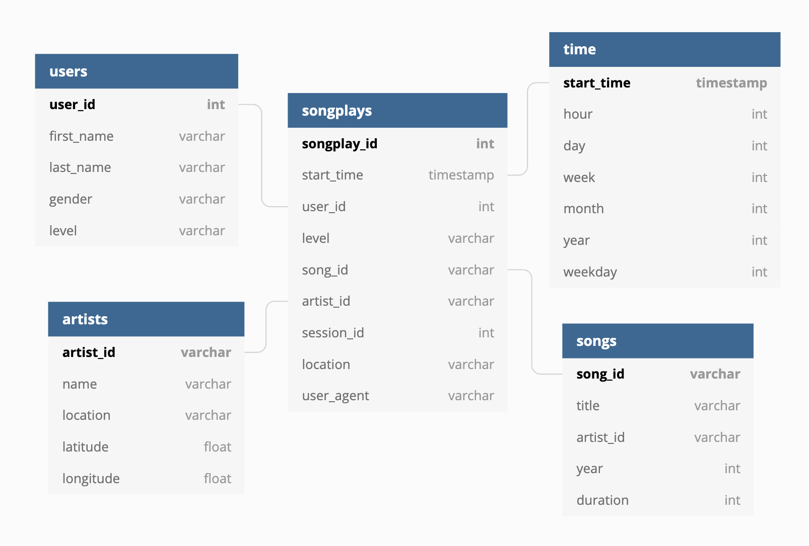

# Project:Data Lake

### Objective
Design an ETL Data Lake pipe using AWS for music streaming startup, Sparkify.

### Database

The database of Sparkify follows the star schema model to query the user behavior and song information of Sparkify database. To accommodate for larger scale, we have implemented the database using AWS cloud service, where they easily ingest and process data at scale. We use the Apache Spark based on Amazon Elastic MapReduce to run our python file periodically to ingest and process the data.

The star schema bases its fact table on the song-playing action of the user. The songplays fact table stores the related data on the play history like start_time, user_id, level, song_id, artist_id, session_id, location and user_agent. Four dimension tables branch out from the fact table: users, songs, time, artists. These dimension table stores the details of each factor in the song-playing event. By doing so, we can fetch and join between different details we are interested in by leveraging the songplays fact table.

