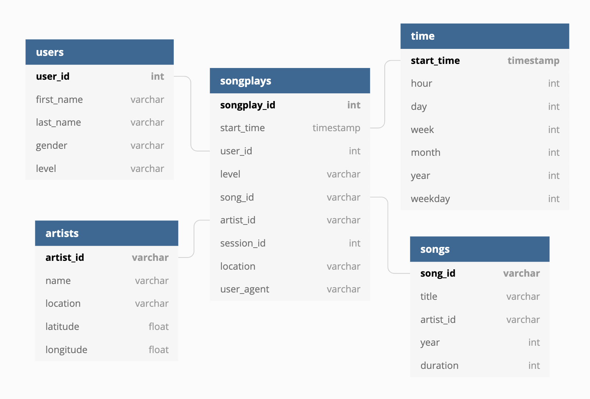

# Sparkify Datawarehousing using Amazon RedShift

### Objective
Create ETL using Amazon Redshift for Sparkify song data

### Process Steps
- Using `redshift_setup.ipynb`, create the IAM role and CLUSTER using IAC approach
- When the cluster creation is complete, run the `create_tables.py` for creating tables
- Run the `etl.py` process to start the ETL

### Datasets and Schema

The song and log data are simulated records of song information and song play data. 
The raw data is first copied into staging_events and staging_songs table and then processed into our table.
In this way, we can perform the necessary transformation process directly with SQL.

The database is designed with STAR schema. The songplays table is the fact table that saves event data according to user's play information. Other dimension tables branch out and store specifics about users, songs, artists, and times.

